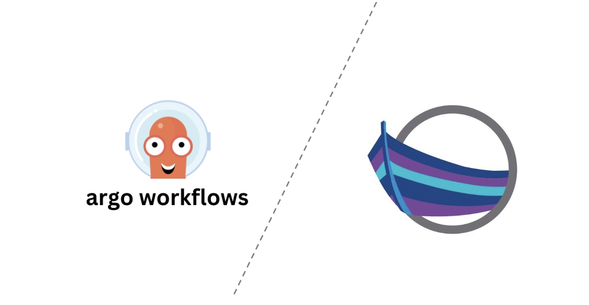

# Argo Workflows Accelerator for LLMs

This is an accelerator that can be used to generate an Argo Workflows deployment which integrates with KappController to deploy an LLM model.



* Install App Accelerator: (see https://docs.vmware.com/en/Tanzu-Application-Platform/1.0/tap/GUID-cert-mgr-contour-fcd-install-cert-mgr.html)
```
tanzu package available list accelerator.apps.tanzu.vmware.com --namespace tap-install
tanzu package install accelerator -p accelerator.apps.tanzu.vmware.com -v 1.0.1 -n tap-install -f resources/app-accelerator-values.yaml
Verify that package is running: tanzu package installed get accelerator -n tap-install
Get the IP address for the App Accelerator API: kubectl get service -n accelerator-system
```

Publish Accelerators:
```
tanzu plugin install --local <path-to-tanzu-cli> all
tanzu acc create llm-argo-pipelines-kapp-acc --git-repository https://github.com/agapebondservant/sample-llm-argo-workflow-kappcontroller-accelerator.git --git-branch main
```

## Contents
1. [Pre-requisites](#prereq)
2. [Deploy Argo Training Pipeline](#deploy)

### Deploy Pre-requisites <a name="prereq">
* Set up the following pre-requisites on your Kubernetes cluster:
[ ] Argo Workflows
[ ] Tanzu Cluster Essentials

* Set up permissions:
```
kubectl apply -f resources/rbac.yaml
kubectl apply -f resources/rbac-2.yaml
```

### Deploy Argo Training Pipeline on TAP <a name="deploy">
* From the directory root, deploy the pipeline:
```
ytt -f pipeline_app.yaml -f values.yaml | kapp deploy -a <app-name> --logs -y  -nargo -f -
```

* Set up environment variables:
```
export DATA_E2E_HUGGINGFACE_TOKEN=<your huggingface token>
export DATA_E2E_LLMAPP_TRAINING_DB_URI=<your Postgres Training Database>
```

* Set up Configmaps and Secrets that will be leveraged by the pipelines (requires SealedSecrets - see <a href="https://github.com/bitnami-labs/sealed-secrets" target="_blank">link</a>)
```
envsubst < resources/appcr/pipeline_configmap.in.yaml > resources/appcr/pipeline_configmap.yaml
kubectl apply -f resources/appcr/pipeline_configmap.yaml -n argo
kubectl create secret generic huggingface-token --from-literal=token=${DATA_E2E_HUGGINGFACE_TOKEN} --dry-run=client -o yaml > llm-huggingface-token-secret.yaml
kubeseal --scope cluster-wide -o yaml <llm-huggingface-token-secret.yaml> resources/appcr/llm-huggingface-token-sealedsecret.yaml
kubectl apply -f resources/appcr/llm-huggingface-token-sealedsecret.yaml -nargo
```

* Set up GitOps sync hook with kappcontroller's App CR:
```
kapp deploy -a llm-pipeline-<THE PIPELINE ENVIRONMENT> -f resources/appcr/pipeline_app.yaml --logs -y  -nargo
```

* View progress:
```
kubectl get app <app-name> -oyaml  -nargo
```

* To delete the pipeline:
```
kapp delete -a <app-name> -y -nargo
```
